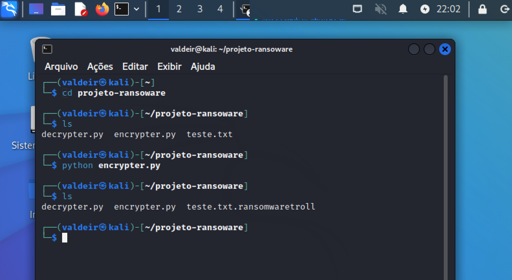
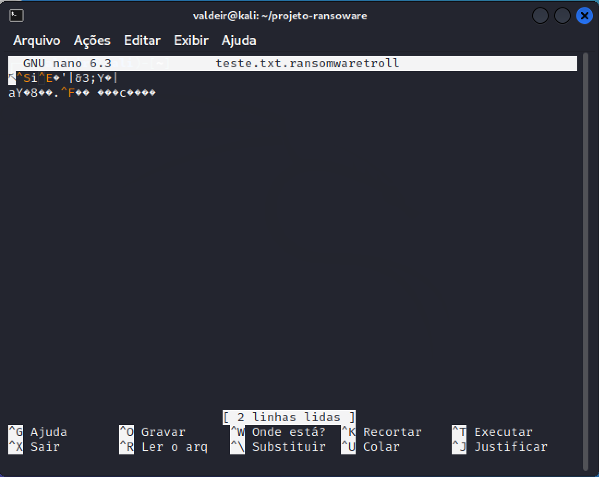
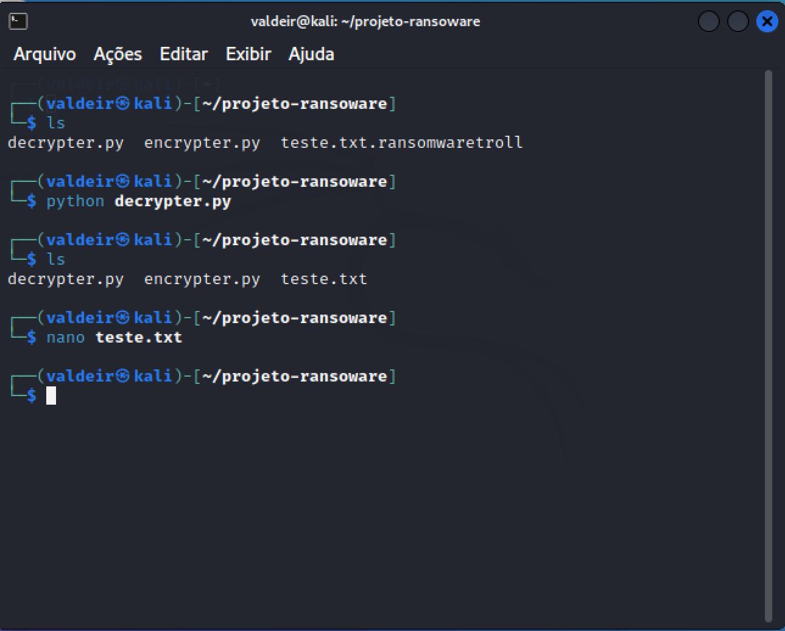
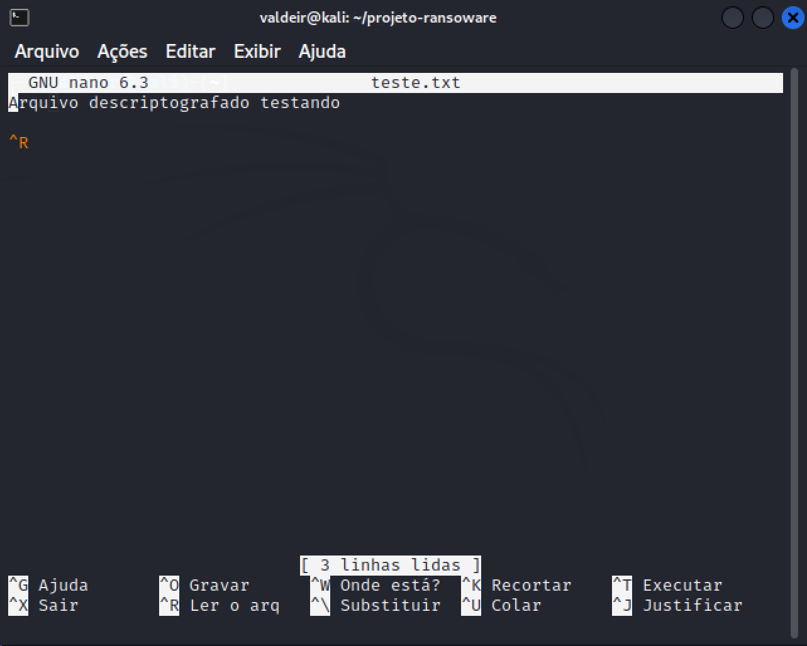

# cibersecurity-desafio-ransomware

Projeto criado para o desafio "Criando um Ransomware com Python"

Obs: Foi necessário instalar a biblioteca pyaes para rodar os scripts 
"pip3 install pyaes"

